# Fetalino Dental Practice

The Fetalino Dental Practice website for a dental practice trying to showcase its available services to the public in the Bristol area.

Users of the site will be able to find all of the necessary information regarding the dental practice, such as: its location, opening times, available treatments, images of the practice, multiple ways to contact the practice, dental plans, images of other patient results, certifications etc. 

The site is targetted towards anyone in the Bristol area looking for dental services.

Link: https://semmtm.github.io/Fetalino-Dental-Practice-/index.html

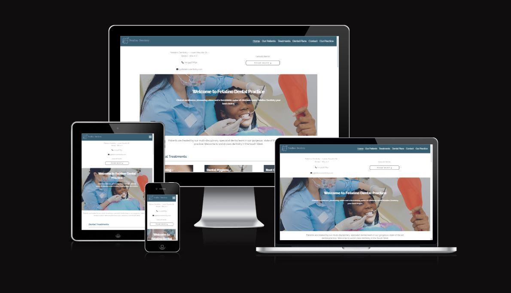

## The Aim

- The aim of the website is to provide the user with the information they require as easily as possible.
- We want to make them aware of the services offered by the practice.
- Make the user feel confident in the practice and their ability to provide an exeptional service.
- Showcase previous work and make getting in contact with the practice as easy as possible.

## Features
### Navigation

- A quick navigation at the top of the page which links to all of the most important pages for the user. 
- The nav collapses into a drop down when the screen size is smaller then 1024px.
- Fetalino Dental logo in the corner.
- Each page name is underlined when hovered over and has an underline on the active page.
- The navigation is sticky to the top of the page for easier access for the user. 

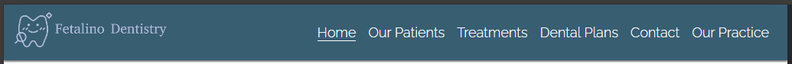

### The Top Page Banner
- This contains essential information that a user of the site may want access to immedietly. Such as a contact email address, phone number and location of the practice.

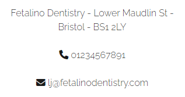

- There is a quick select navigation for the most common things users of the site want to do. This improves the user experience.

- Both of these are responsive on screen sizes above 1024px.

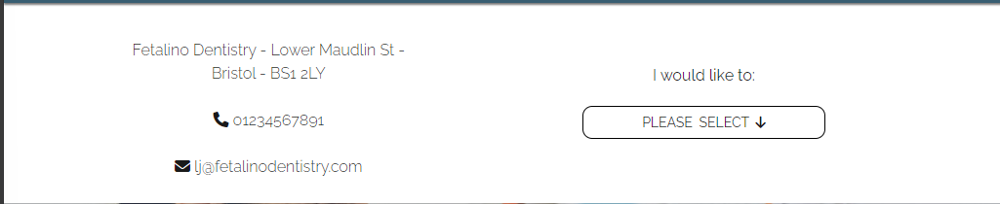

- Each page also has a hero banner with the Fetalino Practice slogan and a relevant image that changes on each page.
- This is the top of every page on the site.

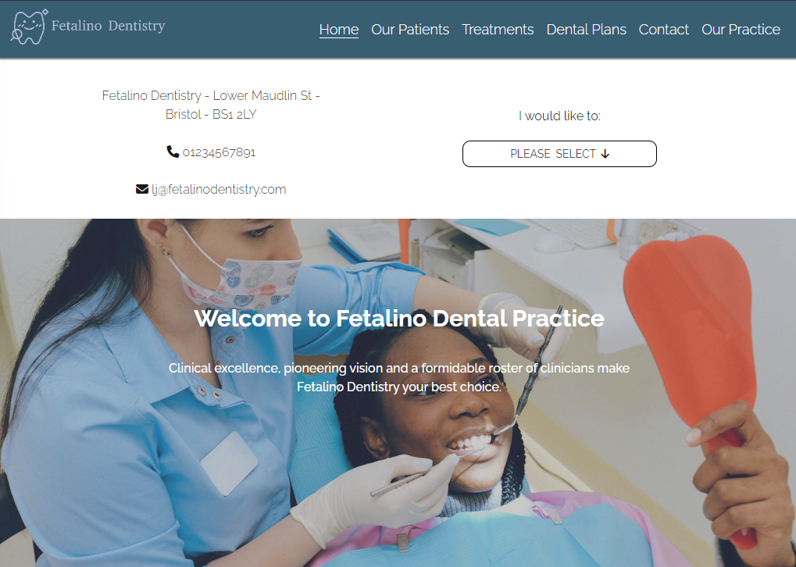

### Homepage

- The start of the page features a small message which is aimed to give the user a feeling of confidence in the Fetalino Dental Practice.
- The homepage has been constructed to give the easiest access to the most relevent info possible while also giving the user confidence in the Fetalino Dental Practice.

#### Treatments Section

- Next is a few tiles of common dental treatments that the practice offers. These are some of the most common ones but others are available on the "Treatments" page.
- The aim of this is to get the user to the relevent information as quickly as possible.
- These tiles reorganise themselves depending on the view port size.
- They are clickable and have an overlay so that the text is easily readable.
- At the bottom of the section is a "view all" button. This indicates to the to the user that we have more treatments available.
- Each tile has an image relevent to the treatment so the user has a visual to go with the text.

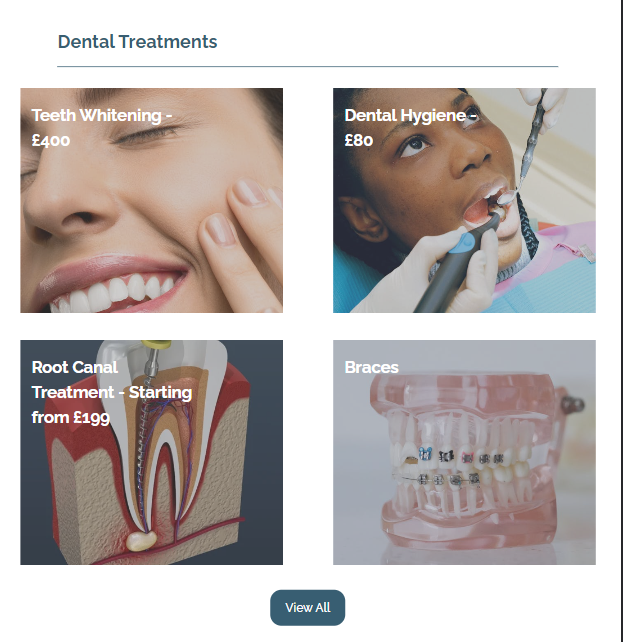

#### Our Patients and Practice Section

- Next is a section which showcases our patient results and our practice.
- Each tile shows a relevent image with a description about our results and our practice. This is done to give the user more information about our practice and our results. Ideally making the user feel more confient in us and encouraging them to become a patient.
- Each tile has a "find out more" button to encourage the user to see more of our client results and our practice.
- This is also responsive depending on screen size.

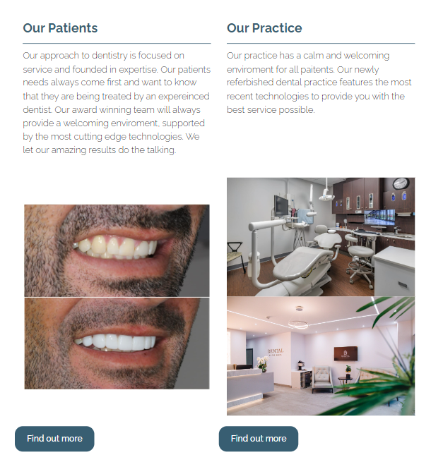

#### Our awards section

- This section showcases the awards we have won as a practice.
- The aim of showcasing these awards is to establish further credibility with the user. 

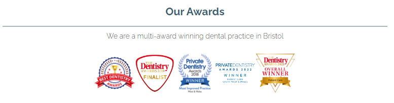

#### Book an apointment section

- This is a form where the user can easily fill out their information to get a call back from the practice.
- There is also an embeded google map and all relevent contact info if the user wants to call us or visit directly.

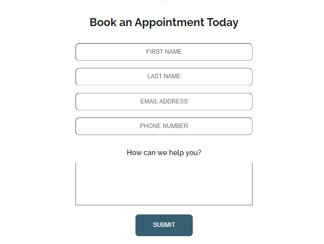

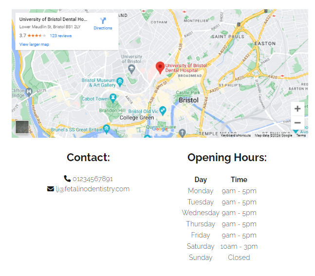

### Footer

- The footer contains all relevent info that a user may want access to quickly.
- Its features our address, opening hours, contact email and phone number, an embedded google map, social links that open in a new tab and copyright.
- This is responsive for all screen sizes.

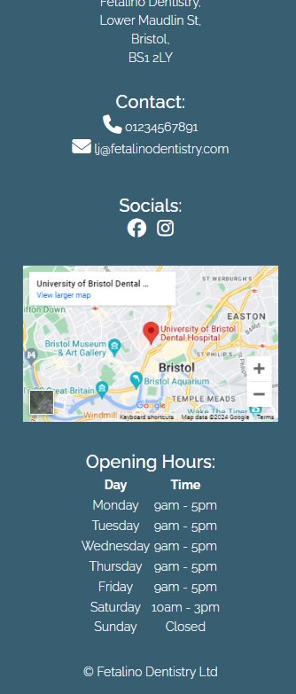

### Our Patients Page

- This is a gallery of our client results.
- Images and tiles are resized to look good on all screens.
- The bottom of the page features the clinics awards and a contact section so the user can easily enquire about a treatment.

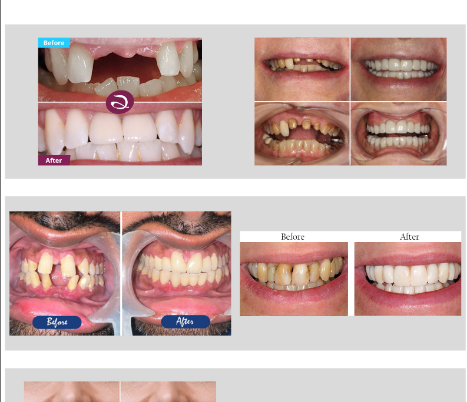

### Treatments Page

- A page showing all available treatments offered by the clinic with starting prices, detailed descriptions and relevent images.
- The top of the page features a quick naviagtion so the user can quickly get to the relevent treatment for them.
- Each treatment on the quick nav is underlined when hovered on and when selected quickly takes you to that section on the page.

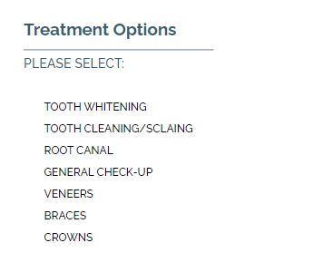

- The whole page is responsive for all screens.
- Each treatment features a "Book an appointment" button at the bottom of each description for convenience. This button takes the user to a contact form.

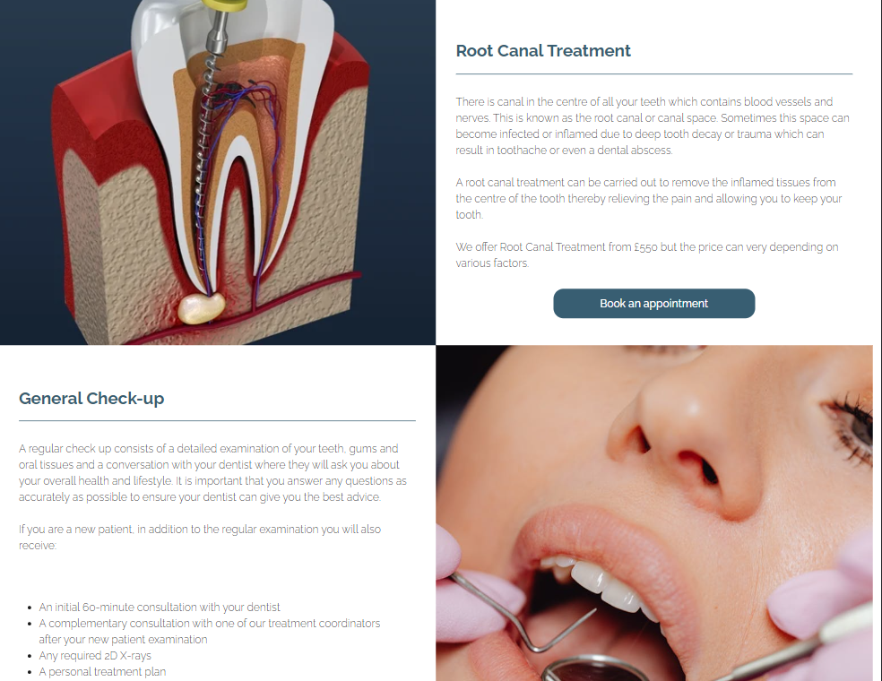

- There is a contact form at the bottom of the page with an embedded google map, contact info an opening hours.

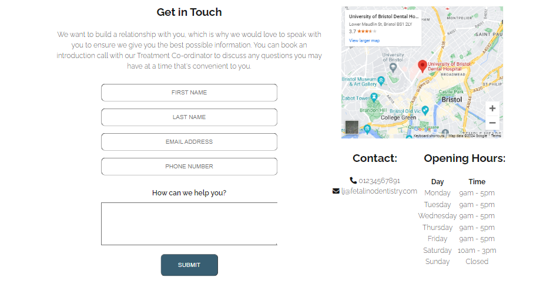

### Contact Us Page

- A contact form with first name, last name, email, phone number and a text box.
- The form has client-side validation.
- The email needs an @ or it wont allow the form to be submitted.
- This page also features an embedded google map, contact info for the practice and opening hours.
- The page is responsive on all screen sizes.
- Its the same as the contact section screenshot above. 

### Our Practice Page

- A gallery of images of different rooms in our practice and dentists doing treatments.
- The images are organised into tiles which are repositioned depending on the screen size.
- The images also resize depending on screen size.
- This provides the user with a clear and detailed look of the practice.

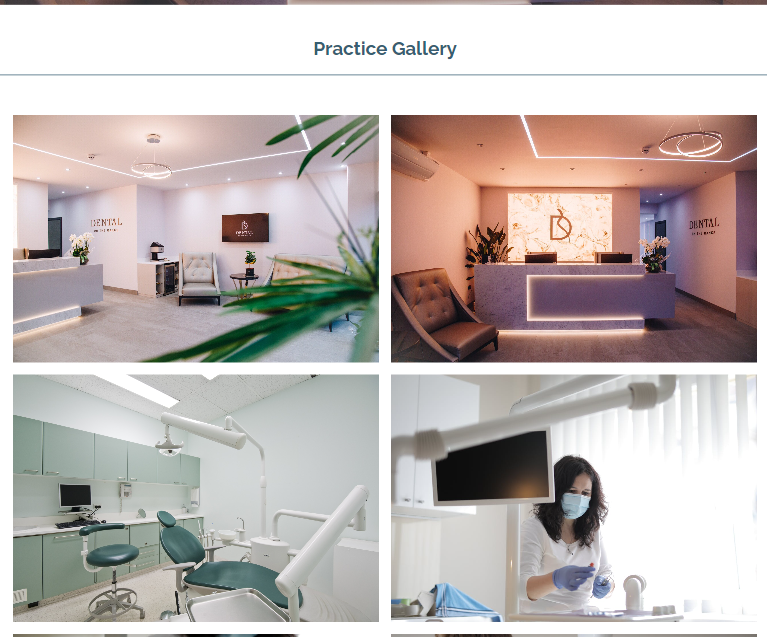

### Dental Plans Page

- This page showcases all available monthly dental plans.
- We explain the benefits of dental plans and what our aim is.
- This page provides clear information to any user looking to recieve a plan.
- There is a contact section at the bottom of the page so the user can easily enquire about getting a plan.

## Testing

- I have tested the site on multiple browsers: Chrome, Safari and Opera. 
- I have confirmed that the project and all pages are responsive on different screen sizes.
- All links have been tested.
- All external links open in a new tab.
- Header and all navigation is easy to read on all pages and screen sizes.
- All forms have client side validation and need information in before they can be submnitted.
- All forms submit correctly.

## Bugs

### Fixed bugs

After deployment of the project, the logo in the header was not loading. This was because I used an absolute file path instead of a relative one. 

Another image on the home page was not loading because the file name had some characters that did not match the exact file name. I just reselected the image and the file name was corrected.

### Unfixed Bugs

- No bugs on the deployed page.

## Credits

### Content

- Icon from Fontawesome was used as the favicon and I used https://realfavicongenerator.net/svg-favicon/ to generate the images and code.
- Header nav side bar for mobile was taken from thye CI Love Running Project
- Help on embedding google map to footer: https://docs.presscustomizr.com/article/206-integrating-a-google-map-of-your-headquarter-in-the-footer-of-the-customizr-theme
- Help with applying an overlay on the Hero image: https://blog.logrocket.com/guide-image-overlays-css/
- Making overlay clickable to another link: https://www.geeksforgeeks.org/how-to-create-an-html-button-that-acts-like-a-link/
- Content for treatment descriptions in treatments section have been taken from various dental websites
- Multiple images from Pexels used

## Validator Testing

- HTML - No errors when passing all pages through the validator 

- CSS - No errors when passing the stylesheet through the validator

- Accessibility - Fonts and colors used are easily to read and accessibility has been tested on google speed test.

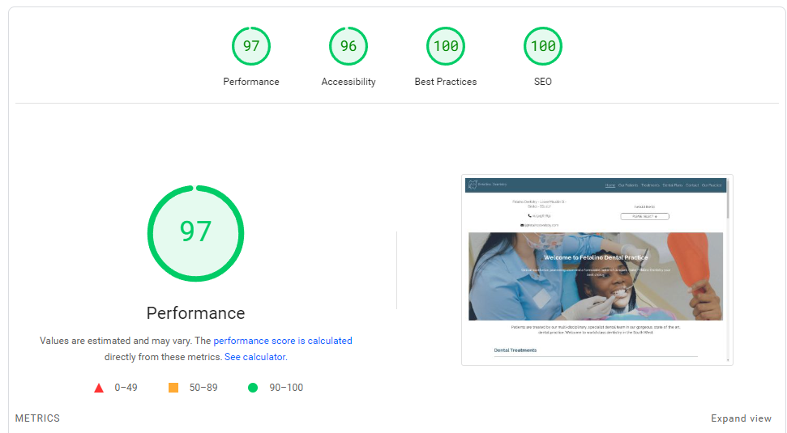

## Deployment

- The site was deployed to Github pages.